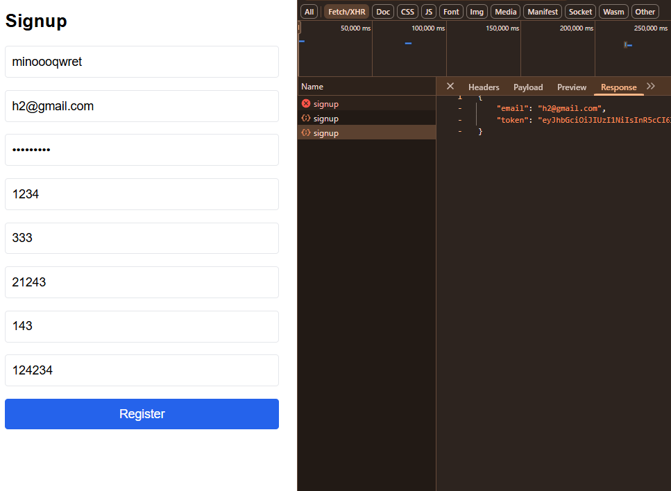
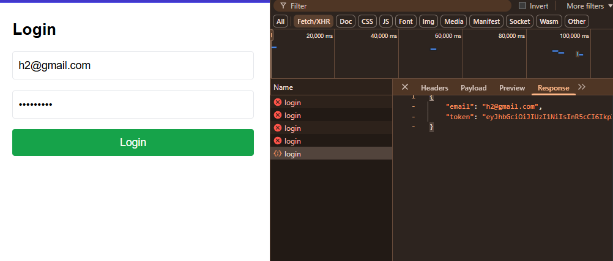
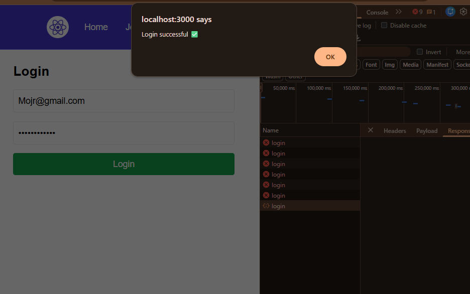
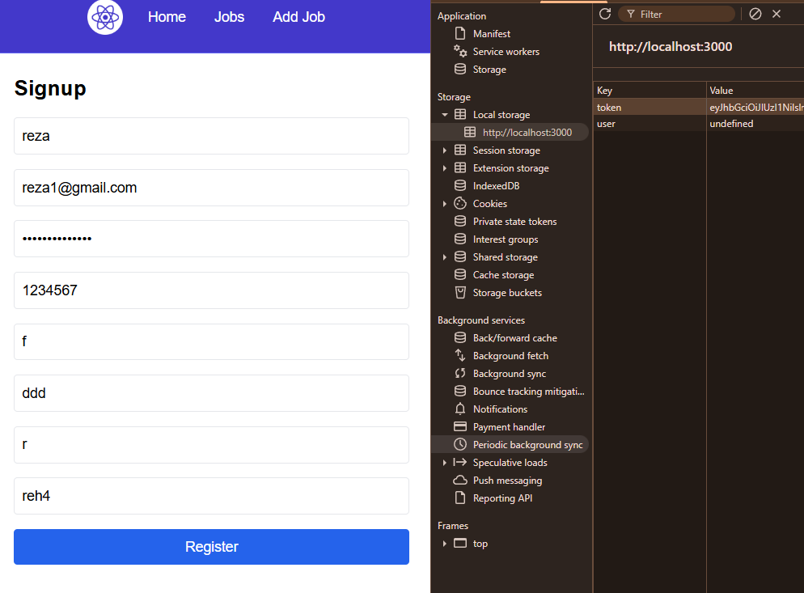

# Self-Assessment – Coding Marathon 2 (Integrations 1–3)

## Frontend–Backend Connection

- Configured Vite proxy to connect frontend to backend (port 4000)
- Fixed incorrect proxy target (8000 → 4000)
- Resolved ECONNREFUSED error
- Fixed route configuration issues
- Resolved 404 and 500 errors
- Verified MongoDB connection
- Tested `/api/jobs` endpoint successfully

---

## Signup Implementation

- Connected to `/api/users/signup`
- Sent correct request structure (including address object)
- Handled backend validation errors:
  - Password not strong enough
  - User already exists
- Tested multiple signup attempts
- Verified 200 and 400 responses
- Prevented UI crashes during failed requests

Successful signup and backend response:

---

## Login Implementation

- Connected to `/api/users/login`
- Handled incorrect password error
- Stored token in localStorage
- Stored user in localStorage
- Fixed JSON.parse(undefined) issue
- Implemented redirect to `/jobs` after successful login

Successful login response:

Login success message:

---

## State Management & Persistence

- Created AuthContext
- Prevented crash on initial mount
- Handled undefined values in localStorage
- Verified login persistence after refresh

---

## Token Storage

Token successfully stored in localStorage:

---

## Git & Workflow

- Created separate branch
- Moved files from frontend-simplified to frontend
- Created clean commits
- Opened Pull Request
- Responded to review feedback
- Replaced axios with fetch as requested